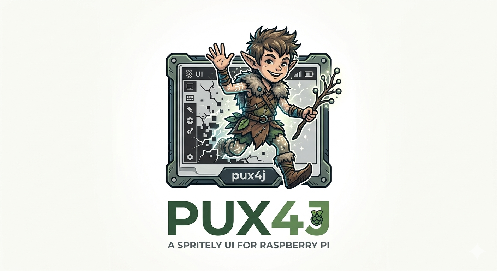

# pux4j — Pi User Experience for Java

<p align="center">
  
</p>

`pux4j` is a Java 25 library for driving WaveShare eInk displays on Raspberry Pi and
integrating them with JavaFX applications.

Write a standard JavaFX application. On desktop it renders normally. On a Raspberry Pi with
a WaveShare eInk HAT it drives the eInk panel instead — no hardware-specific logic in your
application code.

---

## Getting Started

### Hardware and OS prerequisites

- Raspberry Pi (any model with GPIO; tested on Pi 500+, Pi Zero 2 W)
- WaveShare Touch e-Paper HAT (2.13" V4 or 2.9" V2)
- Pi OS 12 (Debian bookworm), aarch64
- Java 25 or GraalVM CE 25 installed (via sdkman: `sdk install java 25.0.2-tem`)

### Two operating modes

**Mode A — Build and run directly on Pi:**
```bash
mvn package -P dist-hat-2in9v2    # or dist-hat-2in13v4
```
Then run via the generated distribution scripts.

**Mode B — Build on a laptop, deploy to Pi:**
```bash
mvn package -P dist-hat-2in9v2
# Copy pux4j-validation/target/pux4j-validation-hat-2in9v2.zip to Pi
# Unzip and run install.sh
```

### Quick-start commands (on the Pi)

```bash
bin/run-smoke-test.sh              # 7-step display refresh smoke test
bin/run-hardware-validation.sh     # 10-step interactive touch validation
bin/run-demo.sh                    # JavaFX counter demo (JVM only)
```

### Expected results

- **Smoke test**: completes 7 refresh steps and exits; logs show "Step N/7 complete". Any hardware issue will cause an exception.
- **Hardware validation**: interactive 10-step test prompting you to tap screen targets; writes a pass/fail report to the working directory on exit.

### HAT variant selection

Default is `hat-2in9v2` (2.9" HAT with SSD1675A + ICNT86X). For the 2.13" HAT (SSD1680 + GT1151Q), use the `hat-2in13v4` Maven profile and pass `--driver ssd1680 --touch gt1151q` to the run scripts.

---

## Mascot

**Pux** is a sprite, inspired by Puck from *A Midsummer Night's Dream*. A sprite is both a
mythological mischief-maker and a computing term for a rendered screen element; Puck causes
things to appear and transform, which is what this framework does to a JavaFX scene on
embedded hardware.

---

## Architecture

`pux4j` is a Maven multi-module project:

```
pux4j/
├── pux4j-core/          Hardware drivers and interfaces — no JavaFX dependency
├── pux4j-transform/     Pixel transformation pipeline — pure Java, no JavaFX, no Pi4J
├── pux4j-test-support/  Headless test doubles — test scope only
├── pux4j-emulator/      JavaFX visual emulator — dev/test only
├── pux4j-fx/            JavaFX bridge
├── pux4j-validation/    Interactive hardware validation test
├── pux4j-demo/          Reference JavaFX demo app; compiled to JVM + native image
└── pux4j-native/        GraalVM native shared library — C API via @CEntryPoint
```

### `pux4j-core`

Hardware driver layer. Defines `EInkDisplayDriver` and `TouchDriver` interfaces and their
supporting types. Concrete drivers are discovered at runtime via `ServiceLoader` from a JSON
config file — switching display targets requires only a config change, not a rebuild.

Bundled drivers:
- `Ssd1675aDisplayDriver` + `Icnt86xTouchDriver` — WaveShare 2.9" V2 HAT (SSD1675A / ICNT86X)
- `Ssd1680DisplayDriver` + `Gt1151qTouchDriver` — WaveShare 2.13" V4 HAT (SSD1680 / GT1151Q)
- `PngEInkDisplay` — writes frames as PNG files for headless / CI use

### `pux4j-transform`

Pixel transformation pipeline. Converts RGBA pixel buffers into packed `FrameData` for a
specific display and decides — based on frame history and display capabilities — which refresh
mode and region to use. No JavaFX, no Pi4J, no native calls. Fully unit-testable in CI.

### `pux4j-fx`

JavaFX bridge. Intercepts the JavaFX scene graph using a pulse-driven `AnimationTimer`,
converts frames via `pux4j-transform`, and pushes updates to the display on a dedicated
virtual thread. Translates hardware touch contacts back into JavaFX `MouseEvent`s.

### `pux4j-emulator`

JavaFX visual emulator for development without physical hardware. Renders the eInk display
on a desktop window; mouse events feed the touch pipeline.

### `pux4j-test-support`

Headless test doubles: `RecordingEInkDisplay`, `ProgrammaticTouchDriver`, and
`FramebufferAssertions` (pixel-level + golden-file PNG comparison).

### `pux4j-validation`

Interactive 10-step hardware acceptance test. Runs against any `EInkDisplayDriver` +
`TouchDriver` pair via `ServiceLoader` and a config file.

### `pux4j-demo`

Reference JavaFX application demonstrating the full stack. Runs on desktop against the
emulator or on Pi against real hardware — driver selected via config only. Cross-compiled to
a GraalVM native image for Pi deployment.

### `pux4j-native`

GraalVM native shared library. Exposes `EInkDisplayDriver`, `TouchDriver`, and the pixel
transformation pipeline via a C API (`@CEntryPoint`), allowing C, Python, Rust, and other
native callers to drive the eInk display without a JVM.

---

## Target Hardware

| Device | OS | Display | Touch IC |
|---|---|---|---|
| Raspberry Pi 500+ | Pi OS 12 aarch64 | WaveShare 2.9" V2 HAT | ICNT86X |
| Raspberry Pi Zero 2 W | Pi OS 12 aarch64 | WaveShare 2.13" V4 HAT | GT1151Q |

Both run Pi OS 12 (Debian bookworm, aarch64).

---

## Technology Stack

| Technology | Role |
|---|---|
| Java 25 | Language and runtime |
| Foreign Function & Memory API (Project Panama) | All hardware access — no JNI |
| Pi4J v4 with `pi4j-plugin-ffm` | SPI and I2C hardware providers |
| JavaFX | Scene graph and application framework (`pux4j-fx` only) |
| GraalVM native image | AOT compilation for Pi deployment |
| JPMS | Module system — every module has `module-info.java` |
| SLF4J + Logback | Logging — no `System.out` anywhere |
| Maven | Multi-module build |

---

## Status

| Phase | Description | Status |
|---|---|---|
| 0 | Maven skeleton — all modules compile, JPMS wired | Complete |
| 1 | JavaFX demo + GraalVM native image verification | In progress |
| 2 | Hardware drivers — SSD1675A, SSD1680, ICNT86X, GT1151Q | Pending |
| 3 | Emulation framework | Pending |
| 4 | GraalVM AOT verification with hardware drivers | Pending |
| 5 | JavaFX bridge + full demo app integration | Pending |
| 6 | CI and GitHub Actions | Pending |
| 7 | Native shared library (C API) | Pending |
| 8 | Native language demo applications | Pending |

---

## License

Apache License 2.0 — see [LICENSE](LICENSE).
